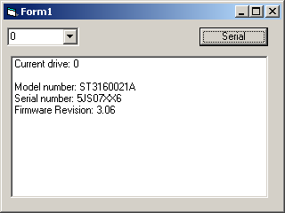



## Hard Drive Serial or Volume Serial UPDATE

### Description

OK.. Finally, the REAL Hard Drive Serial Number - found this on the net somewhere, so if you vote, this code isn't mine. Just cleaned it up a bit and made it all work together.
 
### More Info
 
Hard drive volume ID - 0,1,2..etc.

Hard drive serial number - ACTUAL, Model number and Firmware rev.

             |
---                |---
**Submitted On**   |2007-12-30 14:26:36
**By**             |[M1K3](https://github.com/Planet-Source-Code/PSCIndex/blob/master/ByAuthor/m1k3.md)
**Level**          |Intermediate
**User Rating**    |5.0 (15 globes from 3 users)
**Compatibility**  |VB 5\.0, VB 6\.0
**Category**       |[Coding Standards](https://github.com/Planet-Source-Code/PSCIndex/blob/master/ByCategory/coding-standards__1-43.md)
**World**          |[Visual Basic](https://github.com/Planet-Source-Code/PSCIndex/blob/master/ByWorld/visual-basic.md)
**Archive File**   |[Hard\_Drive20956912302007\.zip](https://github.com/Planet-Source-Code/m1k3-hard-drive-serial-or-volume-serial-update__1-69835/archive/master.zip)

